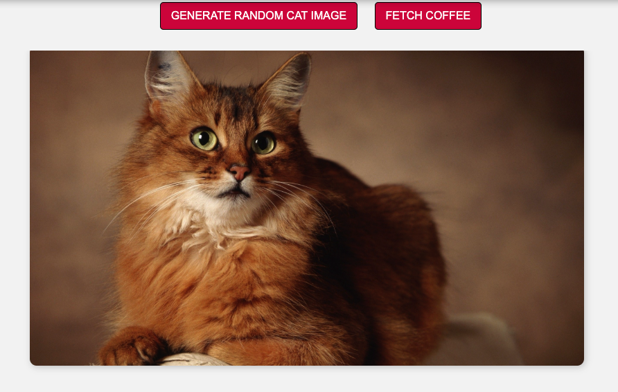
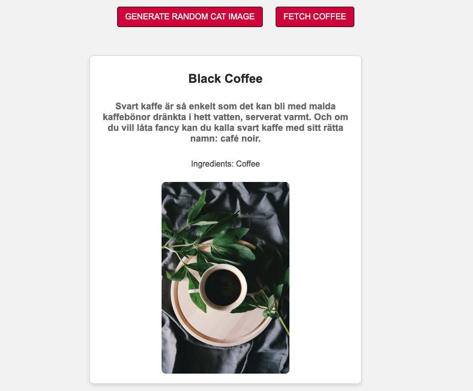

# Cats and Coffee App

This is a simple web application that lets users:
- Generate a random cat image using the [TheCatAPI](https://thecatapi.com/)
- Fetch information about hot coffee drinks from an API and display it on the page

### Features
- **Generate Random Cat Images**: Displays a random cat image each time the "Generate Random Cat Image" button is clicked.
- **Fetch Coffee Data**: Displays a list of hot coffee drinks, including name, description, ingredients, and an image of the drink when the "Fetch Coffee" button is clicked.
- **Responsive Layout**: The layout adjusts to fit both mobile and desktop devices.

### Technologies Used
- **HTML**: Structure of the page
- **CSS**: Styling and layout of the app
- **JavaScript**: Fetching data from APIs and handling user interactions

### Sample Look
<h2>Cat Generator</h2>

<br />

<h2>Coffee Generator</h2>

<br />


### How to Run Locally

1. Clone the repository:
   ```bash
   git clone https://github.com/ErmatovRustam/random-cats-and-coffee.git
